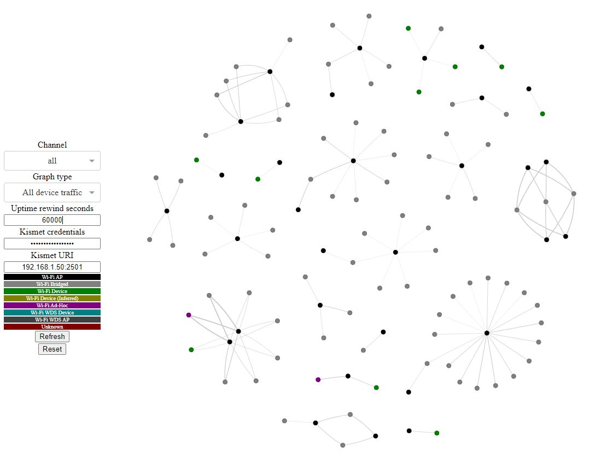
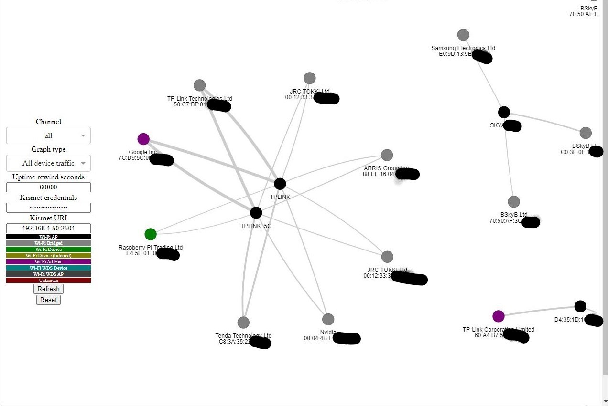
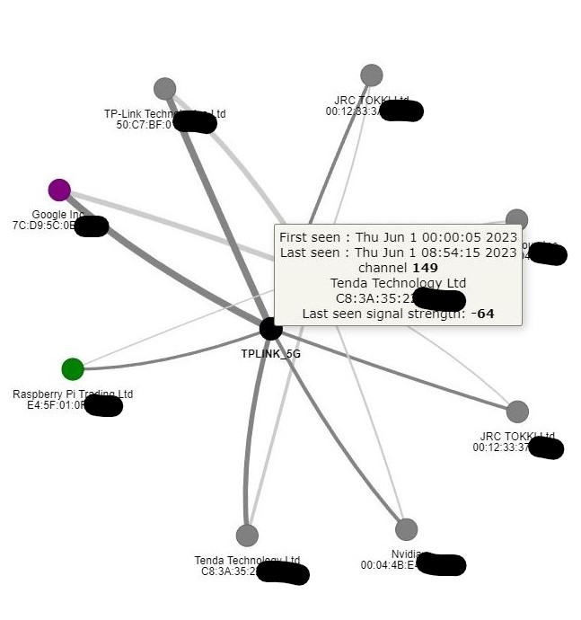
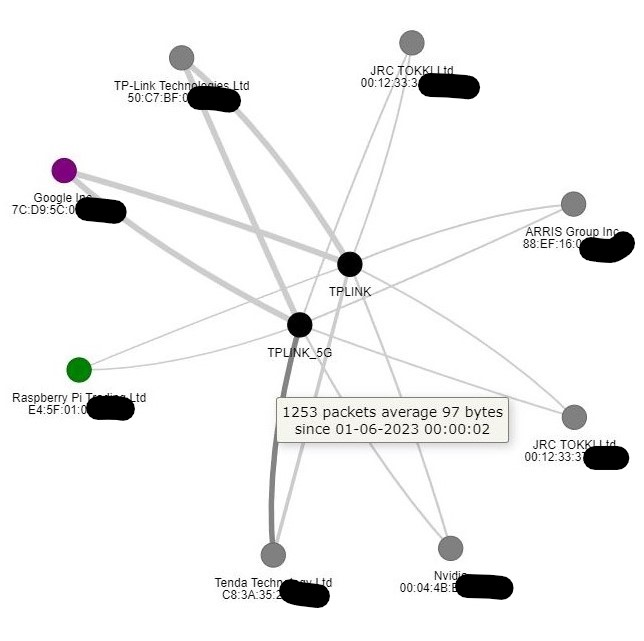
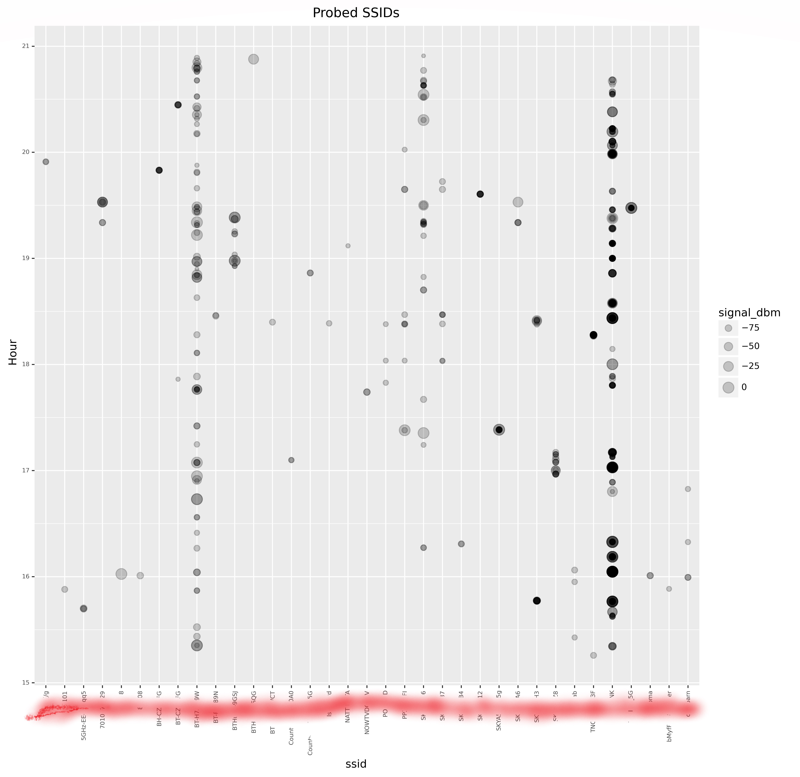

# KismetUIPlugin

Pretty useful graphs for [Kismet](https://github.com/kismetwireless/kismet) like below:

<table>
  <tr>
    <td>
    <td>
  </tr>
  <tr>
     <td>
     <td>
  </tr>
</table>

# Installing

Install [Kismet](https://www.kismetwireless.net/) enabling the options in kismet to allow non-supersuers to collect packets.

Then (enabling the options in wireshark to allow non-supersuers to collect packets):

```console
sudo dpkg-reconfigure wireshark-common
```

Then:

``` console
chmod u+x start.sh

chmod u+x stop.sh

chmod u+x restart_tshark.sh

sudo apt-get install python3-pandas python3-pandas-lib libopenblas-dev tshark

sudo usermod -aG kismet your-user-here

sudo usermod -aG wireshark your-user-here

python3 -m venv venv

source venv/bin/activate

pip3 install -r requirements.txt

deactivate
```

Then you must **reboot** to allow the user group changes to take effect.

By default this visualisation server runs on port 8050, change the line at the bottom of the [python code](./KismetUIPlugin.py) if needed.

# Using

**Important:** Created and/or edit /etc/kismet/kismet_site.conf to meet your interface needs e.g.

``` console
source=wlan0
kis_log_packets=true
logging_enabled=false
enable_logging=false
log_prefix=/tmp
kis_log_alert_timeout=86400
kis_log_device_timeout=86400
kis_log_message_timeout=86400
kis_log_packet_timeout=86400
kis_log_snapshot_timeout=86400

```


**Important:** Then edit the bottom line of and [start.sh](start.sh) to capture probes if needed on your prmoiscous wlan interface/s. Default is *wlan0mon*.

Then:

``` console
./start.sh
./stop.sh
```

# User interface

You can interact with the graph (important as information may be hiding off the screen) as follows:

**Mouse** | **Feature**
----- | -------
```Wheel``` | Zoom in and out
```Left button``` | Drag whole graph or specific nodes
```Hover``` | Node and edge information

You can interact with the menu as follows:

**Label** | **Explanation**
----- | -----------
```Channel``` | Select all or a specific channel seen, this list is updated dynamically by refreshing your browser (CTRL F5)
```Graph type``` | Choose what to graph
```Kismet credentials``` | username:password e.g. me:12345
```Kismet URI``` | Kismet API URI e.g. 192.168.1.50:2501
```Rewind timeframe (s)``` | How long back you will start to look, bigger values mean bigger graphs, and too small will yield nothing
```Refresh``` | Refresh the graph based on what you have
```Reset``` | Reset the graph back to defaults

# Real time Probe alerts

You can get MQTT alerts when a probe comes in based on what is in what is in [process_real_time_probes.example.cfg](process_real_time_probes.example.cfg).

# Automated periodic probed ssid visualisation 



Put something like [this](crontab) in your crontab file to update visualisation images say every 24 hours but changing */home/pi/Documents/Share/wifi* to what works for you.

Enjoy


