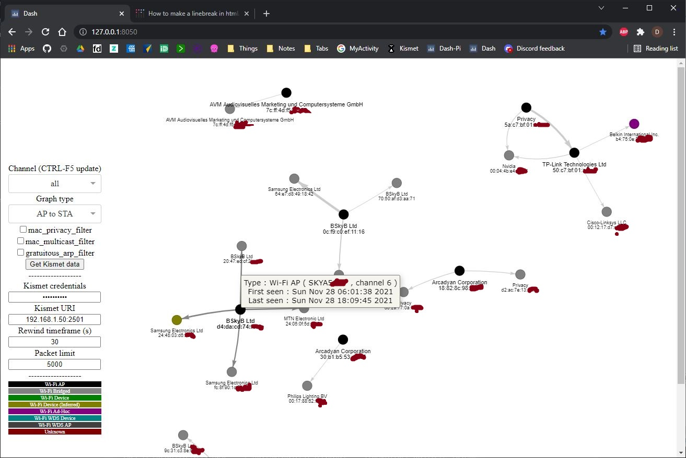

# KismetUIPlugin

Pretty and useful graphs for [Kismet](https://github.com/kismetwireless/kismet) like below:

# Installing

Run the server [python file](./KismetUIPlugin.py) (needs 3.7 or above) with the [required dependancies](./requirements.txt) installed (pip3 install -r requirements.txt).

You must also install Wireshark and have a valid PATH for editcap (linux) or editcap.exe (windows).

By default this visualisation server runs on port 8050, change the line at the bottom of the [python file](./KismetUIPlugin.py) if needed.

If you are lazy and prone to leaving credentials lying around, can edit the following tokens in the [python file](./KismetUIPlugin.py):

| **Label** |    **Example**   | **Explanation** | 
| :-------------: | :----------: | :----------: | 
| 'kismet_credentials' | 'pi:12345' | kismet api login credentials |
| 'kismet_uri'  | '192.168.1.50:2501' |  kismet api URI location |

# User interface

You can interact with the graph as follows:

| **Mouse** | **Feature** |
| :-------------: | :----------: |
| Wheel | Zoom in and out |
| Left button | Drag whole graph or specific nodes |
| Hover | Node and edge information |

You can interact with the menu as follows:

| **Label** | **Explanation** | 
| :-------------: | :----------: |
| Channel | Select all or a specific channel seen, this list is updated dynamically by refreshing your browser (CTRL F5) |
| Graph type | Choose what to graph. |
| Kismet credentials | username:password e.g. pi:12345 |
| Kismet URI | API URI e.g. 192.168.1.50:2501 |
| Rewind timeframe (s) | How long back you will start to pull back devices seen in the Kismet database |
| Get Kismet data | Go get some data to graph |

Enjoy

